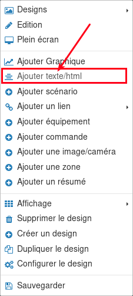
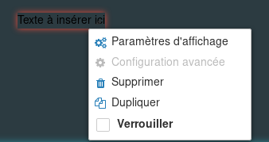
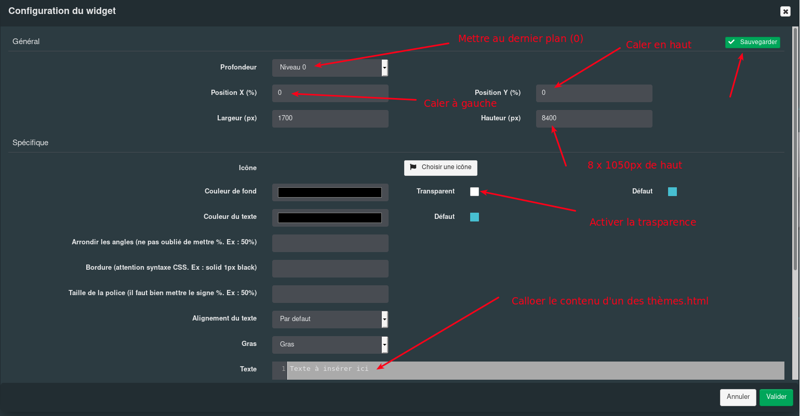

# nextdom-theme-design

## Les thèmes

- AdminLTE : version pour PC et tablette
- AdminLTE mobile : version pour smartphone

## Mise en place

### Prérequis

Avant toute chose il vous faut connaitre la résolution d'écran de votre périphérique : Hauteur & Largeur

Une fois noté, récupérer le fichier html du thème choisis et chercher/remplacer *height:1050px;* par la hauteur  de votre écran (étant donné qu'il y a 8 menus, il y a 8 "écrans design" Vous devez donc modifier cette hauteur 8 fois..

### Configuration du thème

Pour appliquer ce "thème" à votre design sous NextDom, vous devez effectuer les actions suivantes :

- Créer un nouveau design

- Clic droit -> Configurer  le design

- Dans lea fenêtre de configuration, remplir comme suit :

*la largeur et hauteur sont à définir selon la résolution requise (hauteur à saisir = 8x hauteur d'écran)*

- Ensuite ajouter un widget texte/html

- Clic droit sur le nouveau widget ajouté , puis cliquer sur Paramètres d'affichage:

- Dans la fenêtre de paramètrage, remplir comme suit :

-
*la largeur et hauteur sont à définir selon la résolution requise tout comme pour le design, cependant il est préférable de mettre une largeur moins importante*

- Le design est terminé, il reste à l'alimenter avec vos équipements !