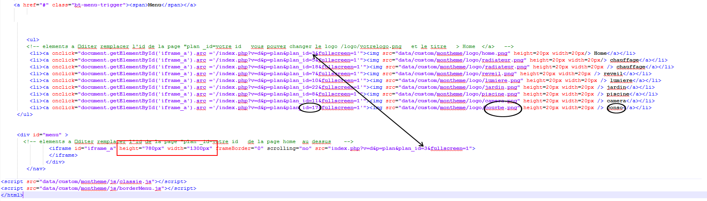
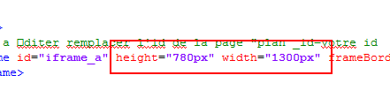
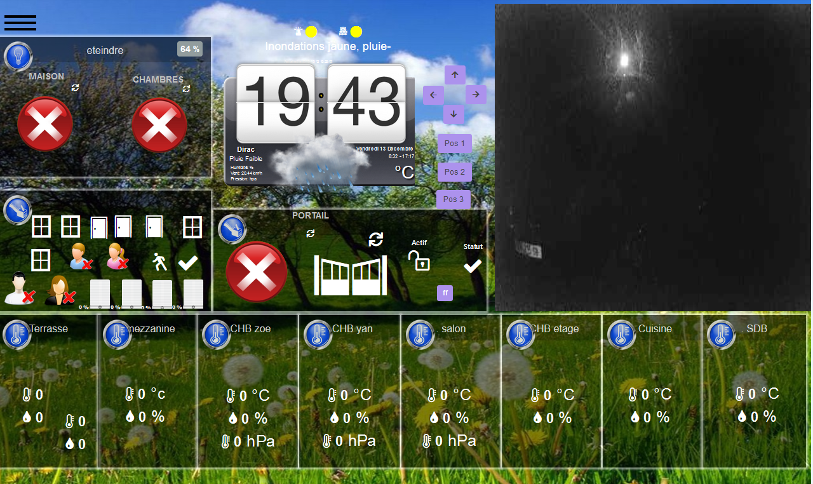
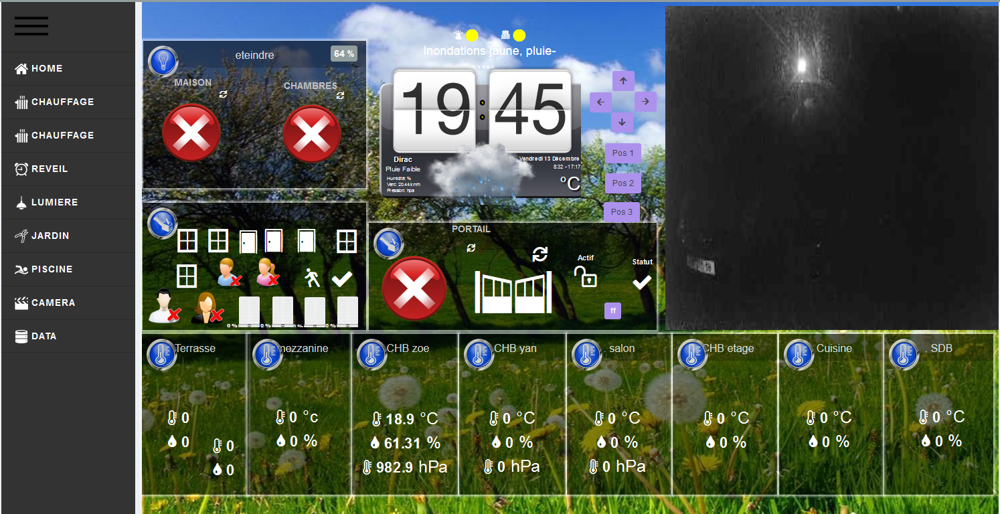

# nextdom-theme-design

## Mise en place

### Prérequis

Avant toute chose il vous faut connaitre la résolution d'écran de votre périphérique : Hauteur & Largeur

recuperer le nombre de pages , et leur ID

Une fois noté, copier le contenu du fichier html du thème choisi et renseigner les pages que vous souhaitez, en modifiant le fichier index.html

soit id =     le logo /home/png et le titre  Home
<! &plan_id=3&fullscreen=1'"> Home -->

ajuster le nombre de menu en supprimant, ou en dupliquant les lignes de menu

nota ne pas oublier de faire correspondre l'id de Home a l'id du lien de l'iframe

<! &plan_id=3&fullscreen=1'"> Home -->	

<! id="iframe_a" height="780px" width="1300px" frameBorder="0" scrolling="no" src="index.php?v=d&p=plan&plan_id=3&fullscreen=1"-->	

### Configuration du thème

Pour appliquer ce "thème" à votre design sous NextDom, vous devez effectuer les actions suivantes :

- Créer un nouveau design dit design menu

- Clic droit -> Configurer  le design

- Dans la fenêtre de configuration, remplir comme suit :

*la largeur et hauteur sont à définir selon la résolution requise exemple 1300x800*

- Ensuite ajouter un widget texte/html

- Clic droit sur le nouveau widget ajouté , puis cliquer sur Paramètres d'affichage:
-

le mettre a x = 0 y = 0
agrandir au maximum la case texte. elle doit prendre tout l'espace.

il vous reste alors a copier le contenu du fichier midifié , index.html
-

pour modifier la taille par defaut de 1280x768
modfier la partie iframe du fichier index.html
<iframe id="iframe_a" height="780px" width="1300px" fr

- Le design est terminé, il reste à l'alimenter avec vos équipements !
-
-
