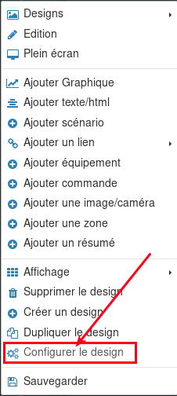

# nextdom-theme-design / mmenujs

## Description

Ce thème pour mobile est inspiré du menu proposé par le site mmenusjs.com.
Il permet de créer un menu reprenant l'expérience d'una application mobile avec plusieurs sous-menus.
Il donne aussi la possibilité de naviguer à l'aide d'onglets, de filtrer l'affichage des menus et de nombreuses autres options.

2 versions sont disponibles : une version full (avec la possibilité de nombreux paramètres) et une version light (chargement plus léger mais aux paramétrage plus limité)

## Mise en place

### Prérequis

- Copier le contenu du fichier /full/menu.html pur la version full (ou /light/menu.html) 

- Copier le dossier /themes dans le répertoire /var/www/html/data/custom de Nextdom

- Renseigner le contenu du menu : 

- Il faut renseigner la structure Json présente dans le code de menu.html (S'inspirer du contenu existant et l'adapter en fonction de ses besoins) en renseignant pour chaque item un libellé et un identifiant de la page du design pour le lien. 

- Il faut choisir si on souhaite afficher les écrans dans une frame (une seule page de design contient le menu qui chargera les pasges de design à afficher à partir des renseignements du json) ou si on charge une nouvelle page (chaque page du design devra contenir le menu)

- Il faudra penser à renseigner les paramètres largeur et hauteur en les faisant correspondre à la taille du widget text/html ajouté ci-dessous

### Configuration du thème

Pour appliquer ce "thème" à votre design sous NextDom, vous devez effectuer les actions suivantes :

- Créer un nouveau design (ou ouvrir un design existant)

- Clic droit -> Configurer le design

- Dans la fenêtre de configuration, remplir la taille et la hauteur (pour un nouveau design)

- Ensuite ajouter un widget texte/html

- Clic droit sur le nouveau widget ajouté , puis cliquer sur Paramètres d'affichage:

- Dans la fenêtre de paramètrage, remplir comme suit :

&nbsp;
Profondeur : mettre au dernier plan (0)

&nbsp;
Position X et Position Y : mettre 0

&nbsp;
Largeur et Hauteur : adapter à la largeur et hauteur du design

&nbsp;
Transparent : activer la transparence

&nbsp;
Texte : coller le contenu modifié de menu.html

- Le design est terminé, il reste à l'alimenter avec vos équipements !

